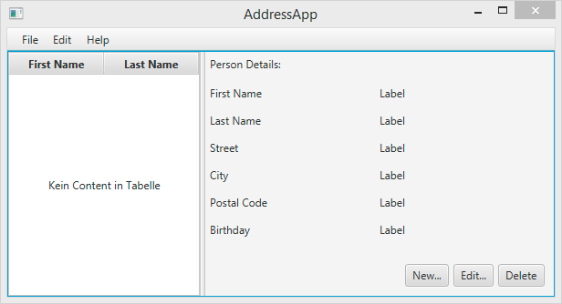
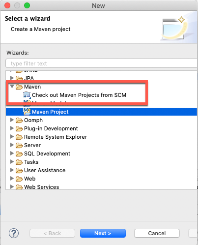
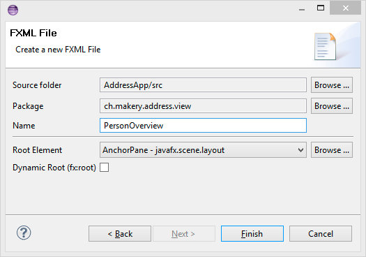

# Part 1: Scene Builder

| [intro](../README.md)
| [1 Scene Builder](part1.md)
| [2 Model and TableView](part2.md)
| [3 Interacting](part3.md)
| [4 CSS Styling](part4.md)
| [5 Storing Data as XML](part5.md)
| [6 Statics Data](part6.md)
| [7 Deployment](part7.md)
|

Derived from [_Java FX Address Book tutorial_](https://code.makery.ch/library/javafx-tutorial/ ).



<br/>

## Topics in Part 1

- Getting to know JavaFX
- Creating and starting a JavaFX Project
- Using Scene Builderto design the user interface
- Basic application structure using the Model-View-Controller (MVC) pattern

## Prerequisites

- Latest [Oracle](https://www.oracle.com/ch-de/java/technologies/javase-downloads.html) or [OpenJDK](https://adoptopenjdk.net/) (JDK11 onwards does **NOT** include JavaFX).
- An IDE like [IntelliJ](https://www.jetbrains.com/idea/download),
  [Visual Studio Code](https://code.visualstudio.com/?wt.mc_id=vscom_downloads),
  [Netbeans](https://netbeans.apache.org/download/index.html) or [Eclipse](https://www.eclipse.org/downloads/).

-  Configure your development tool stack based on
  [IntelliJ](https://github.com/mbachmann/java-development-environment-installation) or [Eclipse IDE](eclipse.md).

- [Scene Builder](https://gluonhq.com/products/scene-builder/)  (provided by Gluon).
- [Maven](https://maven.apache.org/install.html)

## Helpful Links

You might want to bookmark the following links:

- [Oracle Java Documentation](https://docs.oracle.com/en/java/index.html) for Java Platform, Standard Edition (Java SE)
- [Java 16 API](https://docs.oracle.com/en/java/javase/16/) for Java Platform, Standard Edition (Java SE)
- [Open Java FX](https://openjfx.io/) for Open Source Java FX
- [Getting Started with JavaFX](https://openjfx.io/openjfx-docs/) for Open Source Java FX
- [ControlsFX](https://controlsfx.github.io/javadoc/11.1.0/index.html) - ControlsFX project for additional JavaFX controls


The links to _Java 8_ with _Java FX 8_:

- [Java 8 API](https://docs.oracle.com/javase/8/docs/api/) - JavaDoc for the standard Java classes
- [Oracle JavaFX 8 API](https://docs.oracle.com/javase/8/javafx/api/) - JavaDoc for JavaFX classes
- [Oracle’s JavaFX Tutorials](https://docs.oracle.com/javase/8/javafx/get-started-tutorial/get_start_apps.htm) - Official JavaFX Tutorials by Oracle

Now, let’s get started!

##  Create a new JavaFX Project

This tutorial is based on Maven. It is using the (javafx plugin)(https://github.com/openjfx/javafx-maven-plugin) from
[openjfx](https://openjfx.io/openjfx-docs/#maven). You can find a simple
Java FX project [here](https://github.com/openjfx/samples/tree/master/HelloFX/Maven/hellofx).

The [pom.xml](https://github.com/mbachmann/java-fx-address-book/blob/master/pom.xml) file used
 for this project has some additional dependencies installed:

- [javafx-controls](https://mvnrepository.com/artifact/org.controlsfx/controlsfx)
- [javafx-fxml](https://mvnrepository.com/artifact/org.openjfx/javafx-fxml)
- log4j-api and log4j-core
- gson
- junit-jupiter-api with junit-jupiter-engine, junit-vintage-engine and junit
- mockito-junit-jupiter with mockito-core and assertj-core

JDK-11 and later versions do not contain anymore _Java FX_ components. It means,
we need to include [javafx-controls](https://mvnrepository.com/artifact/org.controlsfx/controlsfx) and
[javafx-fxml](https://mvnrepository.com/artifact/org.openjfx/javafx-fxml) by using _Maven_.

The easiest way starting the _address book tutorial_ is by **forking** or _cloning_ this tutorial. Just copy the link
_https://github.com/mbachmann/java-fx-address-book_ in your IDE by using the functionality _New Project from Version Control_.

If you are using IntelliJ:


<br/>

or Eclipse



<br/>

## Create the Packages

Right from the start we will follow good software design principles.
One very important principle is that of
[Model-View-Controller (MVC)](https://en.wikipedia.org/wiki/Model%E2%80%93view%E2%80%93controller).
According to this we divide our code into three units and create a package
If you have cloned this repository the packages are already prepared. In
each package you will find a `.gitkeep` file. As soon as you have your own
files in a package, you can delete `.gitkeep`.

If you are working with your own new project use for each package in the src area  
(Right-click on the src-folder, New… | Package):

- `ch.makery.address` - contains most controller classes (=business logic)
- `ch.makery.address.model` - contains model classes

We are using Maven. Maven wants us to put the fxml view files to the `resources` folder.

- `ch.makery.address.view` - contains views

Note: Our view package will also contain some controllers that are directly related to a single view. Let’s call them view-controllers.

## Create the FXML Layout File

There are two ways to create the user interface.
Either using an XML file or programming everything in Java.
Looking around the internet you will encounter both. We will use XML (ending in .fxml) for most parts.
I find it a cleaner way to keep the controller and view separated from each other.
Further, we can use the graphical Scene Builder to edit our XML.
That means we will not have to directly work with XML.

Right-click on the view package `ch.makery.address.view` in the _resources area_ and create a new FXML Document called `PersonOverview`.

With the _IntelliJ IDE_ you do (Right-click on the resources-folder, New… | fxml File):


<br/>

With Eclipse ...


<br/>

You can configure the Root element to `AnchorPane`.



<br/>

The content of the generated file looks like:

```xml
<?xml version="1.0" encoding="UTF-8"?>

<?import java.lang.*?>
<?import java.util.*?>
<?import javafx.scene.*?>
<?import javafx.scene.control.*?>
<?import javafx.scene.layout.*?>

<AnchorPane xmlns="http://javafx.com/javafx"
            xmlns:fx="http://javafx.com/fxml"
            fx:controller="ch.makery.address.view.PersonOverview"
            prefHeight="400.0" prefWidth="600.0">

</AnchorPane>
```

##  Design with Scene Builder

```
Note: If you can't get it to work, download the source of this tutorial part and try it with the included fxml.
```
