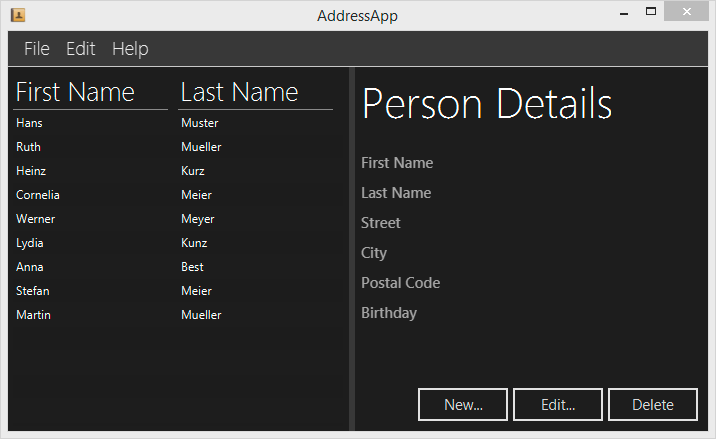
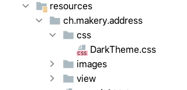
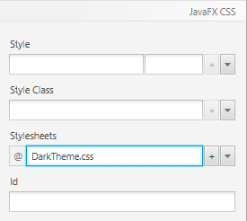
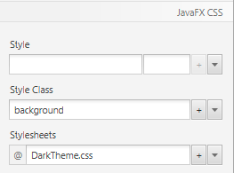
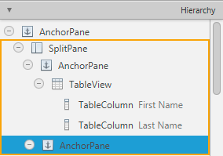
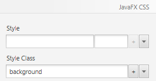
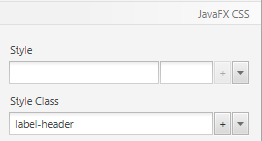
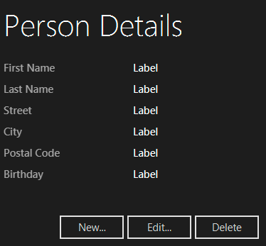
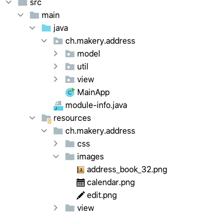

# Part 4: CSS Styling

| [Intro](../README.md)
| [1 Scene Builder](part1.md)
| [2 Model and TableView](part2.md)
| [3 Interacting](part3.md)
| [4 CSS](part4.md)
| [5 XML](part5.md)
| [6 Statistics](part6.md)
| [7 Deployment](part7.md)
|

Derived from [_Java FX Address Book_](https://code.makery.ch/library/javafx-tutorial/) tutorial.



## Topics in Part 4

- CSS Styling
- Adding an Application Icon

### CSS Styling

In JavaFX you can style your user interface using Cascading Style Sheets (CSS).
This is great! It’s never been as easy to customize the appearance of a Java application.

In this tutorial we will create a DarkTheme inspired by the Windows 8 Metro design.
The css for the buttons is based on the blog post [JMetro - Windows 8 Metro controls on Java](https://pixelduke.com/2012/10/23/jmetro-windows-8-controls-on-java/) by Pedro Duque Vieira.

### Getting Familiar with CSS

If you want to style your JavaFX application you should have a basic understanding of CSS in general.
A good place to start is this [CSS tutorial](https://www.csstutorial.net/).

For more JavaFX specific information about CSS:

- [Skinning JavaFX Applications with CSS](https://docs.oracle.com/javase/8/javafx/user-interface-tutorial/css_tutorial.htm) - Tutorial by Oracle
- [JavaFX CSS Reference](https://docs.oracle.com/javase/8/javafx/api/javafx/scene/doc-files/cssref.html) - Official Reference

### Default JavaFX CSS

The default source for CSS styles in **JavaFX 8** is a file called `modena.css`.
This css file can be found in the **Java-8 FX** jar file `jfxrt.jar` located in your Java folder under `/jdk1.8.x/jre/lib/ext/jfxrt.jar`.

Unzip the `jfxrt.jar`. You should find the `modena.css` under `com/sun/javafx/scene/control/skin/modena/`

This default style sheet is always applied to a JavaFX application.
By adding a custom style sheet we can override the default styles of the `modena.css`.

**Hint**: It helps to look at the default _CSS file_ to see which styles you might need to override.

### Attaching CSS Style Sheets

1. Create a folder css:

&nbsp;&nbsp;&nbsp;&nbsp;&nbsp;&nbsp;


2. Add the following CSS file called `DarkTheme.css` to the css package.

**DarkTheme.css**
```css
.background {
    -fx-background-color: #1d1d1d;
}

.label {
    -fx-font-size: 11pt;
    -fx-font-family: "Segoe UI Semibold";
    -fx-text-fill: white;
    -fx-opacity: 0.6;
}

.label-bright {
    -fx-font-size: 11pt;
    -fx-font-family: "Segoe UI Semibold";
    -fx-text-fill: white;
    -fx-opacity: 1;
}

.label-header {
    -fx-font-size: 32pt;
    -fx-font-family: "Segoe UI Light";
    -fx-text-fill: white;
    -fx-opacity: 1;
}

.table-view {
    -fx-base: #1d1d1d;
    -fx-control-inner-background: #1d1d1d;
    -fx-background-color: #1d1d1d;
    -fx-table-cell-border-color: transparent;
    -fx-table-header-border-color: transparent;
    -fx-padding: 5;
}

.table-view .column-header-background {
    -fx-background-color: transparent;
}

.table-view .column-header, .table-view .filler {
    -fx-size: 35;
    -fx-border-width: 0 0 1 0;
    -fx-background-color: transparent;
    -fx-border-color:
        transparent
        transparent
        derive(-fx-base, 80%)
        transparent;
    -fx-border-insets: 0 10 1 0;
}

.table-view .column-header .label {
    -fx-font-size: 20pt;
    -fx-font-family: "Segoe UI Light";
    -fx-text-fill: white;
    -fx-alignment: center-left;
    -fx-opacity: 1;
}

.table-view:focused .table-row-cell:filled:focused:selected {
    -fx-background-color: -fx-focus-color;
}

.split-pane:horizontal > .split-pane-divider {
    -fx-border-color: transparent #1d1d1d transparent #1d1d1d;
    -fx-background-color: transparent, derive(#1d1d1d,20%);
}

.split-pane {
    -fx-padding: 1 0 0 0;
}

.menu-bar {
    -fx-background-color: derive(#1d1d1d,20%);
}

.context-menu {
    -fx-background-color: derive(#1d1d1d,50%);
}

.menu-bar .label {
    -fx-font-size: 14pt;
    -fx-font-family: "Segoe UI Light";
    -fx-text-fill: white;
    -fx-opacity: 0.9;
}

.menu .left-container {
	-fx-background-color: black;
}

.text-field {
    -fx-font-size: 12pt;
    -fx-font-family: "Segoe UI Semibold";
}

/*
 * Metro style Push Button
 * Author: Pedro Duque Vieira
 * http://pixelduke.wordpress.com/2012/10/23/jmetro-windows-8-controls-on-java/
 */
.button {
    -fx-padding: 5 22 5 22;  
    -fx-border-color: #e2e2e2;
    -fx-border-width: 2;
    -fx-background-radius: 0;
    -fx-background-color: #1d1d1d;
    -fx-font-family: "Segoe UI", Helvetica, Arial, sans-serif;
    -fx-font-size: 11pt;
    -fx-text-fill: #d8d8d8;
    -fx-background-insets: 0 0 0 0, 0, 1, 2;
}

.button:hover {
    -fx-background-color: #3a3a3a;
}

.button:pressed, .button:default:hover:pressed {
  -fx-background-color: white;
  -fx-text-fill: #1d1d1d;
}

.button:focused {
    -fx-border-color: white, white;
    -fx-border-width: 1, 1;
    -fx-border-style: solid, segments(1, 1);
    -fx-border-radius: 0, 0;
    -fx-border-insets: 1 1 1 1, 0;
}

.button:disabled, .button:default:disabled {
    -fx-opacity: 0.4;
    -fx-background-color: #1d1d1d;
    -fx-text-fill: white;
}

.button:default {
    -fx-background-color: -fx-focus-color;
    -fx-text-fill: #ffffff;
}

.button:default:hover {
    -fx-background-color: derive(-fx-focus-color,30%);
}

```

We now need to attach the CSS to our Scene. We could do this programmatically in Java code,
but we’ll use the _Scene Builder_ to add it to our `fxml` files.
If we want later dynamically change the `.css`, we must remove the direct attachment of a css to the `.fxml`.


#### Attach CSS to RootLayout.fxml

1. Open the file `RootLayout.fxml` in Scene Builder.

2. Select the root `BorderPane` in the Hierarchy view. Under _Properties_
group add the `DarkTheme.css` file as stylesheet.

&nbsp;&nbsp;&nbsp;&nbsp;&nbsp;&nbsp;

<br/>

#### Attach CSS to PersonEditDialog.fxml

1. Open the file PersonEditDialog.fxml in Scene Builder.
Select the root AnchorPane and choose DarkTheme.css in the Properties group as stylesheet.

2. The background is still white, so add the Style Class background to the root AnchorPane.

&nbsp;&nbsp;&nbsp;&nbsp;&nbsp;&nbsp;

<br/>

3. Select the OK button and choose Default Button in the Properties View.
This will change its color and make this the default button when the enter key is pressed by the user.

#### Attach CSS to PersonOverview.fxml

1. Open the file `PersonOverview.fxml` in Scene Builder.
Select the root `AnchorPane` in the Hierarchy group. Under properties add the `DarkTheme.css` file as stylesheet.

2. You should already see some changes now: The table and the buttons are black.
All class styles .table-view and .button from modena.css apply to the table and buttons.
Since we’ve redefined (and thus overridden) some of those styles in our custom CSS,
the new styles are applied automatically.

3. You might need to adjust the size of the buttons so that all text is displayed.

4. Select the right `AnchorPane` that is inside the `SplitPane`.

&nbsp;&nbsp;&nbsp;&nbsp;&nbsp;&nbsp;

<br/>

5. Go to the Properties group and select background as style class. The background should now turn black.

&nbsp;&nbsp;&nbsp;&nbsp;&nbsp;&nbsp;

<br/>


#### Labels with Different Style


Right now, all the labels on the right side have the same size.
There are already some styles defined in the css file called .label-header and
.label-bright that we’ll use to further style the labels.

1. Select the Person Details label and add label-header as a Style Class.

&nbsp;&nbsp;&nbsp;&nbsp;&nbsp;&nbsp;

<br/>

2. To each label in the right column (where the actual person details are displayed),
add the css Style Class label-bright.

&nbsp;&nbsp;&nbsp;&nbsp;&nbsp;&nbsp;

<br/>

### Dynamically loading an other CSS

The _CSS file_ is permanently connected with the `.fxml` file. This has the big advantage of
getting a **WYSIWYG** feeling in the Scene Builder. But it inhibits the possibility of loading other
CSS files. If you would like to load the CSS programmatically you need to unlink the CSS from the .fxml and
add some CSS loading code in the main class,

This steps are optional:

1. Open all .fxml files and delete the attribute of assigning the CSS `@DarkTheme.css`.

2. Add the code to the `MainApp`:

**methods `initRootLayout()` and `showPersonEditDialog(...)`**

```java
String cssName = "css/DarkTheme.css";
 // Show the scene containing the root layout.
 Scene scene = new Scene(rootLayout);
 if (cssName != null && !cssName.isEmpty()) {
      scene.getStylesheets().add(getClass().getResource(cssName).toExternalForm());
}

```

## Adding an Application Icon

Right now our application just has the default icon in the title bar and taks bar:

Default Icon: &nbsp;&nbsp;

It looks much nicer with a custom icon:

Custom Icon: &nbsp;&nbsp;

### The Icon File

A possible place to get free icons is [Icon Finder](https://www.iconfinder.com/).
I downloaded a little address book icon.

Create a (normal) folder inside your AddressApp project in the **resources** under `ch.makery.address` a subfolder called **images**.
Put the icon of your choice inside the images folder. Your folder structure should look something like this now:

&nbsp;&nbsp;&nbsp;&nbsp;&nbsp;&nbsp;

<br/>

You can download die Icons from [here](https://github.com/mbachmann/java-fx-address-book/tree/4_css_styling/src/main/resources/ch/makery/address/images).

### Set Icon to Scene
To set the icon for our scene add the following line to the start(...) method in MainApp.java

**MainApp.java**

```java
this.primaryStage.getIcons().add(new Image(getClass().getResourceAsStream("images/address_book_32.png")));
```

The whole start(...) method should look something like this now:

```java
 @Override
 public void start(Stage primaryStage) {
     this.primaryStage = primaryStage;
     this.primaryStage.setTitle("AddressApp");

     // Set the application icon.
     this.primaryStage.getIcons().add(new Image(getClass().getResourceAsStream("images/address_book_32.png")));
     
     initRootLayout();

     showPersonOverview();
    }
```

You can also add an icon to the stage of the person edit dialog, of course.

What's Next?

In [Tutorial Part 5](part5.md) we will add XML storage for our data.
